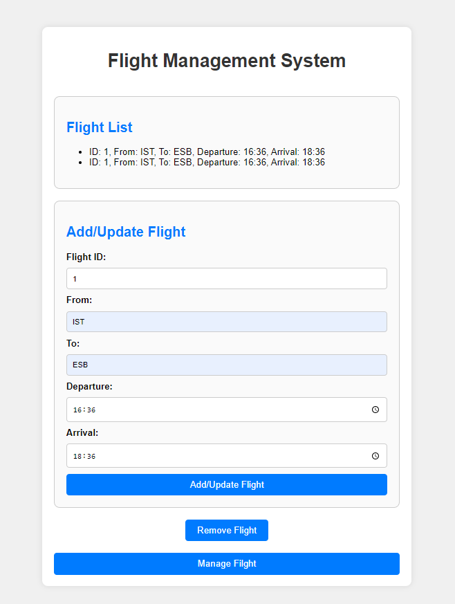

# Uçuş Yönetim Sistemi

Bu proje, JavaScript, HTML ve Bootstrap kullanılarak geliştirilmiş basit bir uçuş yönetim sistemi örneğidir. Kullanıcılar uçuş ekleyebilir, silebilir ve güncelleyebilirler.

## Önizleme



## Nasıl Çalıştırılır
```bash
1. Depoyu klonlayın:
git clone https://github.com/seher-akbas/Ucus-Yonetim-Sistemi.git

2. Klasöre gidin:
cd Flight-Management-System

3.index.html dosyasını bir web tarayıcısında açın.

## Kullanım
1. Uçuş eklemek veya güncellemek için Add/Update Filght düğmesine tıklayın ve gerekli bilgileri girin.
2. Varolan bir uçuşu güncellemek veya silmek için Remove Flight seçin ve Flight ıd girin.
3. Tüm işlemleri yönetebilmek için Manage Flight butonuna tıklayın.

## Dosya Yapısı
index.html: Ana HTML dosyası. (stillendirme için Bootstrap kullanılmıştır)
app.js: JavaScript dosyası (uygulamanın iş mantığı burada).

## Kullanılan Teknolojiler
HTML
CSS (Bootstrap)
JavaScript

